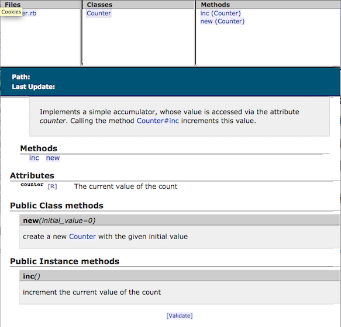

<!SLIDE>
# Documenting Ruby Code #

<!SLIDE bullets incremental>
# Summary #

* RDoc
* YARD
* Let's define CBT standard!

<!SLIDE bullets>
# RDoc #

* Tool to extract and format documentation embedded in Ruby source code files
* Ruby comes bundled with RDoc
* RDoc output: HTML and ri
* ri: command line utility to read RDoc

<!SLIDE smaller>
# Adding RDoc to Ruby Code #

	@@@ Ruby
	# Implements a simple accumulator, whose 
	# value is accessed via the attribute 
	# _counter_. Calling the method Counter#inc 
	# increments this value.
	class Counter

	  # The current value of the count 
	  attr_reader :counter

	  # create a new Counter with the given 
	  # initial value 
	  def initialize(initial_value=0)
	    @counter = initial_value 
	  end

	  # increment the current value of the count 
	  def inc
	    @counter += 1 
	  end

	end
	
<!SLIDE center>
# Visualizing Documentation #
	

<!SLIDE bullets smaller>
# Markup Language #

* paragraphs and headings
* lists and labeled lists
* rules (horizontal lines)
* non-verbatim text (italic, bold, typewriter)
* documentation modifiers 
* stop comments
* links and hyperlinks (automatically recognized)

<!SLIDE>
# Running RDoc #

	@@@ Ruby
	$ rdoc <options> [filenames...]
	
	Format option:
	
	-f, --fmt, --format=FORMAT       
	Set the output formatter.  
	One of: darkfish, html, ri, xml
	
<!SLIDE>
# Running RDoc as a Rake task #
	
	@@@ Ruby
	require 'rake/rdoctask'
	Rake::RDocTask.new do |rdoc|
	  rdoc.rdoc_dir = 'rdoc'
	  rdoc.title = "Counter"
	  rdoc.rdoc_files.include('*.rb')
	end

	$ rake rdoc	

<!SLIDE>
# Let's see an example #

	@@@ Ruby
	$ rdoc -f html *.rb

	Parsing sources with 2 thread(s)...
	100% [ 1/ 1]  counter.rb                                                        

	Generating HTML...

	Files:   1
	Classes: 1
	Modules: 0
	Methods: 10
	Elapsed: 0.1s
	