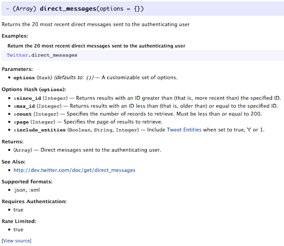

<!SLIDE bullets>
# YARD #

* Documentation generation tool for Ruby
* It can serve documentation for projects or installed gems
* Yardoc meta-tag formatting (@tag)
* RDoc formatting compatibility

<!SLIDE small>
# Available Tags #

	@@@ Ruby
	@abstract, @api, @version,
	@attr, @attr_reader, @attr_writer, @attribute, 
	@author, @deprecated, @example, @macro, @method, @note, 
	@option, @overload, @param, @private, @raise, @return, 
	@scope, @see, @since, @todo, @visibility, 
	@yield, @yieldparam, @yieldreturn

<!SLIDE>
# Using Yard #

	@@@ Ruby
	Installing:
	$ gem install yard
	
	Generating documentation:
	$ yard doc [filenames...]
	$ yardoc [filenames...]
	
	Runs a local documentation server:
	$ yard server			for local project
	$ yard server --gems	for installed gems
	
<!SLIDE smaller>
# Adding Yardoc to Ruby Code #

	@@@ Ruby
	# Returns the 20 most recent direct messages sent to the 
	# authenticating user
	#
	# @format :json, :xml
	# @authenticated true
	# @rate_limited true
	# @param options [Hash] A customizable set of options.
	# @option options [Integer] :since_id Returns results with an ID greater than (that is, more recent than) the specified ID.
	# @option options [Integer] :max_id Returns results with an ID less than (that is, older than) or equal to the specified ID.
	# @option options [Integer] :count Specifies the number of records to retrieve. Must be less than or equal to 200.
	# @option options [Integer] :page Specifies the page of results to retrieve.
	# @option options [Boolean, String, Integer] :include_entities Include {http://dev.twitter.com/pages/tweet_entities Tweet Entities} when set to true, 't' or 1.
	# @return [Array] Direct messages sent to the authenticating user.
	# @see http://dev.twitter.com/doc/get/direct_messages
	# @example Return the 20 most recent direct messages sent to the authenticating user
	#   Twitter.direct_messages
	def direct_messages(options={})
		response = get('direct_messages', options)
		format.to_s.downcase == 'xml' ? response['direct_messages'] : response
	end
	
<!SLIDE center>
# Visualizing Documentation #

<!SLIDE small>
# Let's see an example #

	@@@ Ruby
	$ yardoc --tag 'format:Supported formats' \
		--tag 'authenticated:Requires Authentication' \
		--tag 'rate_limited:Rate Limited' \
		example.rb
	
	Files:           1
	Modules:         0 (    0 undocumented)
	Classes:         1 (    1 undocumented)
	Constants:       0 (    0 undocumented)
	Methods:         4 (    0 undocumented)
	 80.00% documented